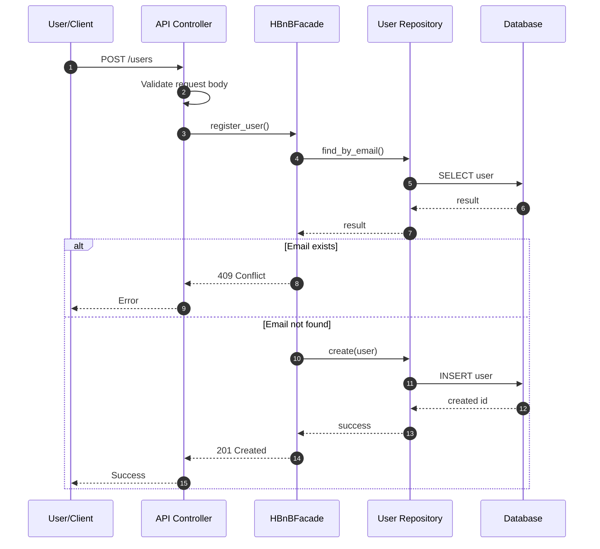
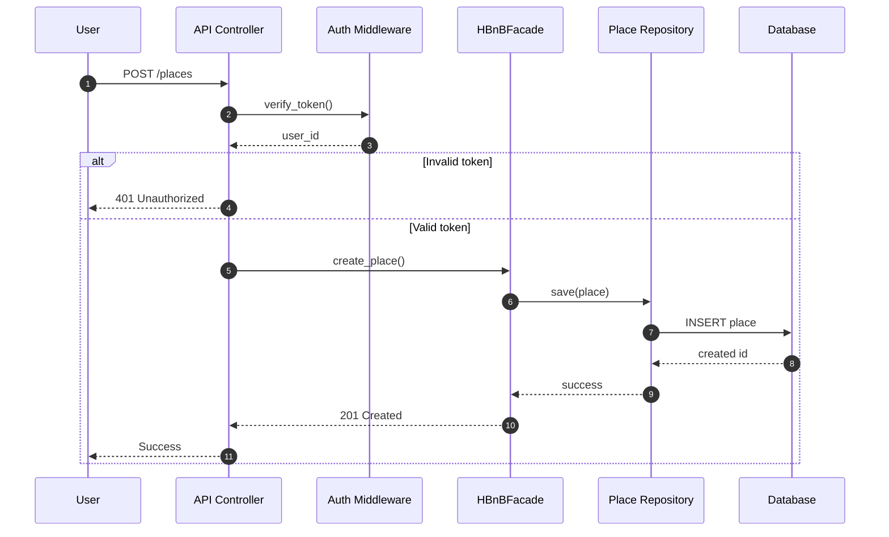
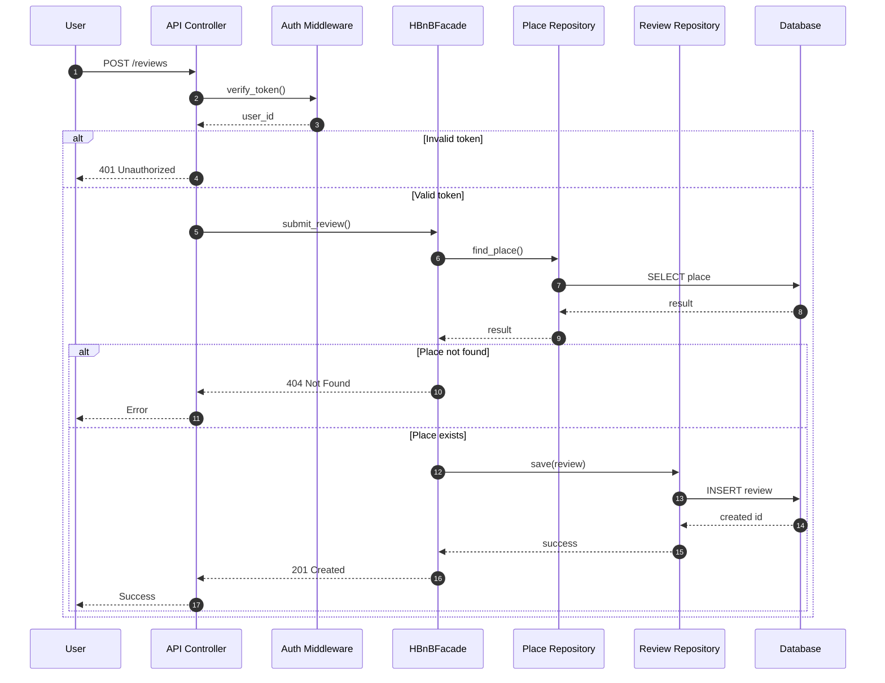
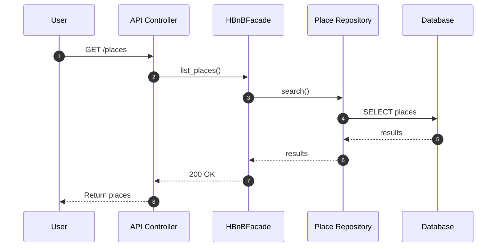

## API Interaction Flow

This section describes how API requests are processed in the HBnB system.
It illustrates the interaction between the Presentation layer, the Business Logic layer,
and the Persistence layer using sequence diagrams.

Each sequence diagram shows how a client request is validated, routed through
the HBnBFacade, processed according to business rules, and persisted using
repository abstractions. The goal is to clearly demonstrate responsibility
separation and request flow consistency across different API endpoints.

## 1) User Registration — POST /users

---

### User Registration Flow — Explanation

**Purpose**
This flow handles the creation of a new user account while ensuring data validity
and email uniqueness.

**Layer Responsibilities**
- The API Controller validates request format and required fields.
- The HBnBFacade coordinates the registration logic.
- The User Repository handles data lookup and persistence.
- The Database stores the user record.

**Business Rules Applied**
- Email addresses must be unique.
- Required fields must be provided.
- Data must follow expected formats before reaching the business layer.

**Flow Summary**
1. The client sends a registration request.
2. The controller validates the request structure.
3. The facade checks if the email already exists.
4. If the email exists, the process stops with a conflict response.
5. Otherwise, the new user is saved.
6. A success response is returned.

**Error Scenarios**
- Invalid request format → 400 Bad Request
- Email already exists → 409 Conflict
- Database failure → 500 Internal Server Error

## 2) Place Creation — POST /places

---

### Place Creation Flow — Explanation

**Purpose**
This flow allows an authenticated user to create a new place listing.

**Layer Responsibilities**
- The API Controller receives the request and delegates authentication.
- Auth Middleware validates the token and extracts the user_id.
- The HBnBFacade applies business rules and orchestrates creation.
- The Place Repository persists the place.
- The Database stores the place record.

**Business Rules Applied**
- Only authenticated users can create a place.
- The owner of the place is derived from the token (`user_id`), not trusted from the request body.
- Place fields must pass validation (e.g., required fields, non-empty values, valid price/range if defined).

**Flow Summary**
1. Client sends POST /places.
2. Controller calls auth middleware to verify the token.
3. If invalid → request stops with 401.
4. If valid → facade creates the place using the authenticated user_id.
5. Repository saves the place to the database.
6. Success response is returned.

**Error Scenarios**
- Missing/invalid token → 401 Unauthorized
- Invalid request data → 400 Bad Request
- Database failure → 500 Internal Server Error

## 3) Review Submission — POST /reviews

---

### Review Submission Flow — Explanation

**Purpose**
This flow allows an authenticated user to submit a review for an existing place.

**Layer Responsibilities**
- The API Controller receives the request and delegates authentication.
- Auth Middleware validates the token and extracts the user_id.
- The HBnBFacade ensures the place exists and applies review rules.
- The Place Repository is used to verify the target place.
- The Review Repository persists the review.
- The Database stores the review record.

**Business Rules Applied**
- User must be authenticated.
- The place must exist before creating a review.
- Review fields must be valid (e.g., rating range, required text if defined).
- The reviewer identity comes from the token (`user_id`), not trusted from the request body.

**Flow Summary**
1. Client sends POST /reviews.
2. Token is verified; invalid token stops the request with 401.
3. Facade checks that the referenced place exists.
4. If the place does not exist → return 404.
5. If it exists → repository saves the new review.
6. Success response is returned.

**Error Scenarios**
- Missing/invalid token → 401 Unauthorized
- Place not found → 404 Not Found
- Invalid review data → 400 Bad Request
- Database failure → 500 Internal Server Error

## 4) Fetch Places — GET /places

### Fetch Places Flow — Explanation

**Purpose**
This flow retrieves a list of places from the system.

**Layer Responsibilities**
- The API Controller receives the request and calls the facade.
- The HBnBFacade coordinates retrieval logic.
- The Place Repository performs the query.
- The Database returns matching place records.

**Business Rules Applied**
- This endpoint is typically read-only and may be public (no auth) unless specified otherwise.
- Optional filtering/pagination can be applied at the repository level if implemented.

**Flow Summary**
1. Client sends GET /places.
2. Controller calls list_places() on the facade.
3. Facade requests results from the repository.
4. Repository queries the database and returns results.
5. Controller returns the list with 200 OK.

**Error Scenarios**
- Database failure → 500 Internal Server Error

### Notes on Layer Separation

In all flows, the Presentation layer does not directly access the database.
All business decisions are centralized in the HBnBFacade, while repositories
encapsulate persistence operations. This separation improves maintainability
and keeps responsibilities clear across the system.
