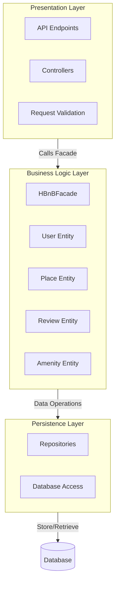
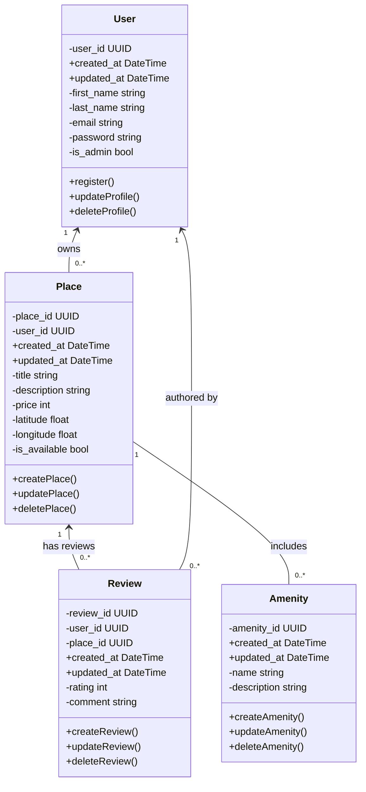
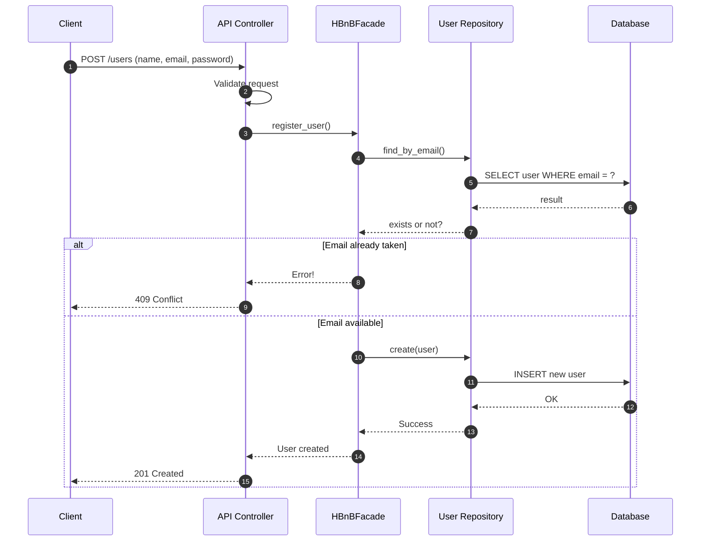
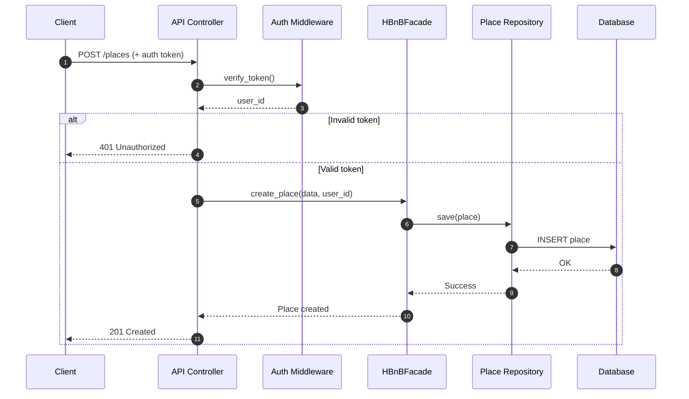
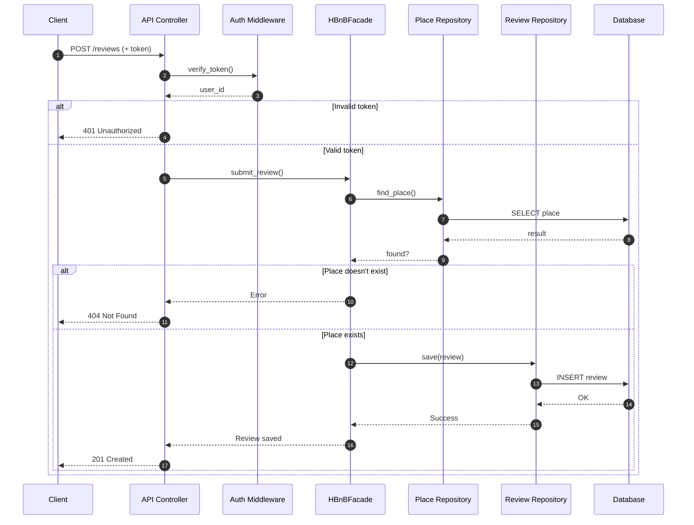
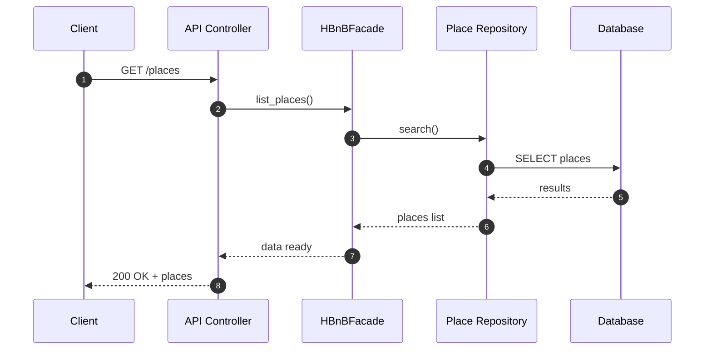

# HBnB Evolution - Technical Documentation

> A blueprint for building a property rental platform (like Airbnb!)

---

## Table of Contents

1. [Introduction](#introduction)
2. [High-Level Architecture](#high-level-architecture)
3. [Business Logic Layer](#business-logic-layer)
4. [API Interaction Flow](#api-interaction-flow)
5. [Design Decisions](#design-decisions)
6. [Implementation Guide](#implementation-guide)

---

## Introduction

### What is this document?

This is your **complete guide** to understanding how the HBnB project works. Think of it as a map that shows you:
- How different parts of the app connect
- What each component does
- How data flows through the system

### What does HBnB do?

HBnB is a rental platform where users can:

| Feature | Description |
|---------|-------------|
| Sign Up | Create an account |
| List Properties | Post places for rent |
| Browse | Search available rentals |
| Review | Rate and comment on places |
| Amenities | See what features each place offers |

### The Three-Layer Architecture

We split the app into **three main layers** to keep things organized:

```
+------------------------+
|   Presentation Layer   |  <-- Handles user requests (APIs)
+------------------------+
           |
           v
+------------------------+
|  Business Logic Layer  |  <-- The brain (rules & entities)
+------------------------+
           |
           v
+------------------------+
|   Persistence Layer    |  <-- Stores data (database)
+------------------------+
```

**Why three layers?** It's like organizing your closet - everything has its place, making it easier to find and change things later!

---

## High-Level Architecture

### System Overview



### What Each Layer Does

#### Presentation Layer
**Job:** Talk to the outside world

- Receives requests from users
- Checks if requests look valid
- Sends responses back
- Handles login tokens

#### Business Logic Layer
**Job:** Make decisions

- Manages Users, Places, Reviews, and Amenities
- Enforces rules (like "emails must be unique")
- Coordinates everything through the **HBnBFacade**

#### Persistence Layer
**Job:** Store and retrieve data

- Saves data to the database
- Fetches data when needed
- Hides database details from other layers

### The Facade Pattern - Explained Simply

The **HBnBFacade** is like a receptionist:

```
Instead of this (messy):          We do this (clean):
┌─────────┐                       ┌─────────┐
│   API   │──┬─→ UserRepo         │   API   │
│         │  ├─→ PlaceRepo        │         │
│         │  ├─→ ReviewRepo       │         │
│         │  └─→ AmenityRepo      │         │
└─────────┘                       └────┬────┘
                                       │
                                       v
                                  ┌─────────┐
                                  │ Facade  │──→ All Repos
                                  └─────────┘
```

**Benefits:**
- One entry point for all operations
- Easier to understand
- Easier to change later

---

## Business Logic Layer

### Class Diagram



### Our Four Main Entities

#### User
> Someone who uses the platform (owner or guest)

| Attribute | Type | What it stores |
|-----------|------|----------------|
| user_id | UUID | Unique identifier |
| first_name | string | First name |
| last_name | string | Last name |
| email | string | Must be unique! |
| password | string | Hashed for security |
| is_admin | bool | Admin privileges? |
| created_at | DateTime | When they signed up |
| updated_at | DateTime | Last profile update |

**Rules:**
- Email must be unique
- Password gets hashed (never stored as plain text!)
- Name fields are required

---

#### Place
> A property listed for rent

| Attribute | Type | What it stores |
|-----------|------|----------------|
| place_id | UUID | Unique identifier |
| user_id | UUID | Who owns it |
| title | string | Property name |
| description | string | Details about it |
| price | int | Cost per night |
| latitude/longitude | float | Location on map |
| is_available | bool | Can be booked? |

**Rules:**
- Must have an owner
- Price must be positive
- Coordinates must be valid

---

#### Review
> Feedback about a place

| Attribute | Type | What it stores |
|-----------|------|----------------|
| review_id | UUID | Unique identifier |
| user_id | UUID | Who wrote it |
| place_id | UUID | Which place |
| rating | int | 1-5 stars |
| comment | string | Written feedback |

**Rules:**
- Must link to existing user AND place
- Rating between 1-5
- One review per user per place

---

#### Amenity
> Features a place offers (WiFi, Pool, etc.)

| Attribute | Type | What it stores |
|-----------|------|----------------|
| amenity_id | UUID | Unique identifier |
| name | string | e.g., "WiFi" |
| description | string | More details |

**Rules:**
- Names should be unique
- Can be used by multiple places

---

### How Entities Connect

| Relationship | Meaning |
|--------------|---------|
| User → Place | One user can own many places |
| User → Review | One user can write many reviews |
| Place → Review | One place can have many reviews |
| Place ↔ Amenity | Places can share amenities |

---

## API Interaction Flow

These diagrams show how requests travel through our system.

### 1. User Registration (POST /users)



**What happens:**
1. Client sends registration data
2. API validates the format
3. Facade checks if email exists
4. If taken → error; If available → save user

---

### 2. Create a Place (POST /places)



**What happens:**
1. Client sends place data + login token
2. Token gets verified → extracts user ID
3. Place gets saved with that user as owner

---

### 3. Submit a Review (POST /reviews)



**What happens:**
1. Verify user is logged in
2. Check the place exists
3. Save the review

---

### 4. Browse Places (GET /places)



**What happens:**
1. Client requests the list
2. Goes straight to database (no auth needed for browsing)
3. Returns all available places

---

### Error Response Summary

| Code | Meaning | When it happens |
|------|---------|-----------------|
| 200 | OK | Request succeeded |
| 201 | Created | New resource made |
| 400 | Bad Request | Invalid input data |
| 401 | Unauthorized | Missing/bad token |
| 404 | Not Found | Resource doesn't exist |
| 409 | Conflict | Duplicate (like email) |
| 500 | Server Error | Something broke |

---

## Design Decisions

### Why did we build it this way?

| Decision | Why? |
|----------|------|
| **Three Layers** | Keeps code organized and testable |
| **Facade Pattern** | One clean entry point to business logic |
| **Repository Pattern** | Easy to swap databases later |
| **UUIDs** | Secure, unique IDs that don't reveal info |
| **Timestamps** | Track when things happen |
| **Email Uniqueness** | Prevent duplicate accounts |

### Why UUIDs instead of numbers?

Regular IDs (1, 2, 3...) have problems:
- Reveal how many users you have
- Easy to guess other user IDs
- Hard to merge databases

UUIDs solve all of this!

---

## Implementation Guide

### Phase 1: Database Setup

Create tables for all entities:

```sql
-- Users table
CREATE TABLE users (
    user_id UUID PRIMARY KEY,
    first_name VARCHAR(255) NOT NULL,
    last_name VARCHAR(255) NOT NULL,
    email VARCHAR(255) UNIQUE NOT NULL,
    password VARCHAR(255) NOT NULL,
    is_admin BOOLEAN DEFAULT FALSE,
    created_at TIMESTAMP DEFAULT CURRENT_TIMESTAMP,
    updated_at TIMESTAMP DEFAULT CURRENT_TIMESTAMP
);

-- Places table
CREATE TABLE places (
    place_id UUID PRIMARY KEY,
    user_id UUID NOT NULL REFERENCES users(user_id),
    title VARCHAR(255) NOT NULL,
    description TEXT,
    price INT NOT NULL,
    latitude FLOAT,
    longitude FLOAT,
    is_available BOOLEAN DEFAULT TRUE,
    created_at TIMESTAMP DEFAULT CURRENT_TIMESTAMP,
    updated_at TIMESTAMP DEFAULT CURRENT_TIMESTAMP
);

-- Amenities table
CREATE TABLE amenities (
    amenity_id UUID PRIMARY KEY,
    name VARCHAR(255) UNIQUE NOT NULL,
    description TEXT,
    created_at TIMESTAMP DEFAULT CURRENT_TIMESTAMP,
    updated_at TIMESTAMP DEFAULT CURRENT_TIMESTAMP
);

-- Link places to amenities (many-to-many)
CREATE TABLE place_amenities (
    place_id UUID REFERENCES places(place_id),
    amenity_id UUID REFERENCES amenities(amenity_id),
    PRIMARY KEY (place_id, amenity_id)
);

-- Reviews table
CREATE TABLE reviews (
    review_id UUID PRIMARY KEY,
    user_id UUID NOT NULL REFERENCES users(user_id),
    place_id UUID NOT NULL REFERENCES places(place_id),
    rating INT NOT NULL CHECK (rating BETWEEN 1 AND 5),
    comment TEXT,
    created_at TIMESTAMP DEFAULT CURRENT_TIMESTAMP,
    updated_at TIMESTAMP DEFAULT CURRENT_TIMESTAMP
);
```

### Phase 2: Build the Code

1. **Create Entity Classes** (User, Place, Review, Amenity)
2. **Create Repositories** (handle database operations)
3. **Create HBnBFacade** (coordinate everything)
4. **Create API Controllers** (handle HTTP requests)

### Phase 3: Test Everything

- **Unit tests** → Test each piece alone
- **Integration tests** → Test pieces working together
- **End-to-end tests** → Test full user journeys

---

## Quick Reference

### API Endpoints

| Method | Endpoint | What it does |
|--------|----------|--------------|
| POST | /users | Register new user |
| GET | /users | List all users |
| PUT | /users/{id} | Update user |
| POST | /places | Create place |
| GET | /places | List places |
| GET | /places/{id} | Get one place |
| PUT | /places/{id} | Update place |
| POST | /reviews | Submit review |
| GET | /reviews | List reviews |
| POST | /amenities | Create amenity |
| GET | /amenities | List amenities |

### Layer Communication

```
Client Request
      ↓
[Presentation] → Validates input
      ↓
[Business Logic] → Applies rules
      ↓
[Persistence] → Saves/retrieves data
      ↓
Database
```

---

**Happy Coding!**

*This document serves as a roadmap. Follow the architecture, respect the layers, and your HBnB project will be clean and maintainable.*
