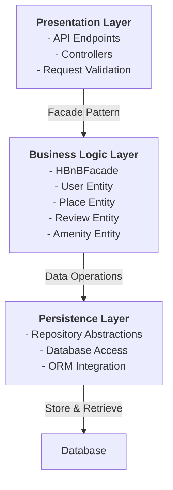
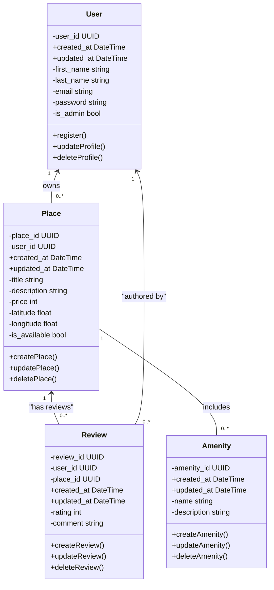
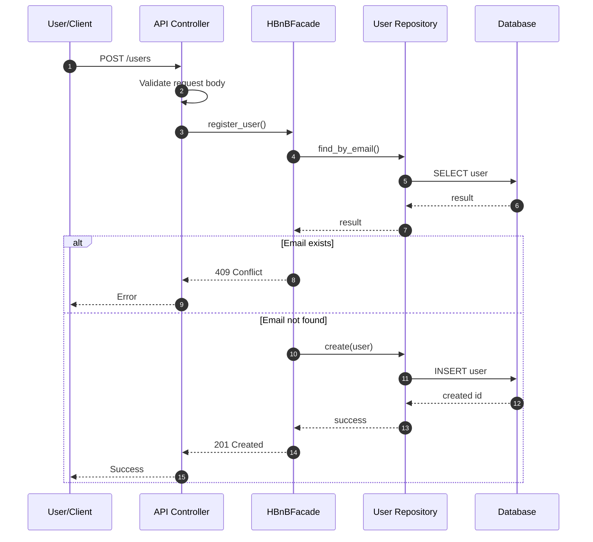
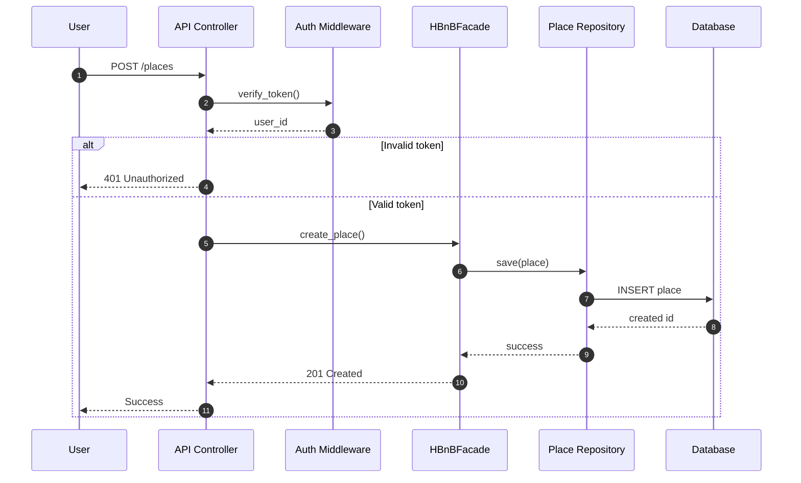
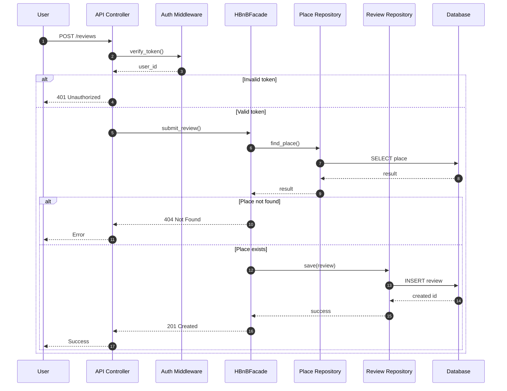
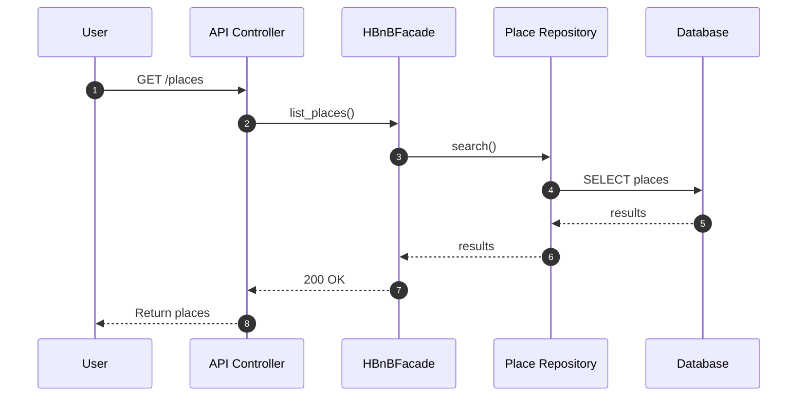

# HBnB Evolution

## Table of Contents

1. [Introduction](#introduction)
2. [High-Level Architecture](#high-level-architecture)
3. [Business Logic Layer – Class Diagram](#business-logic-layer--class-diagram)
4. [API Interaction Flow – Sequence Diagrams](#api-interaction-flow--sequence-diagrams)
5. [Design Decisions & Rationale](#design-decisions--rationale)
6. [Implementation Guidelines](#implementation-guidelines)

---

## Introduction

### Purpose

This document provides a comprehensive technical blueprint for the **HBnB Evolution** project, a property rental platform similar to Airbnb. It consolidates all architectural diagrams, class models, and API interaction flows to guide the implementation phases and serve as a reference for system design.

### Scope

HBnB is designed as a multi-layered application that separates concerns between:

- **Presentation Layer** – Handles client requests and API endpoints
- **Business Logic Layer** – Enforces rules, manages core entities (User, Place, Review, Amenity)
- **Persistence Layer** – Manages data storage and retrieval through repository abstractions

### Project Overview

HBnB enables users to:

1. Register and manage accounts
2. Create and list properties for rent
3. Browse available properties
4. Submit reviews and ratings for properties
5. View and manage amenities (features) associated with properties

This document provides clear specifications for how these features interact within the system architecture.

---

## High-Level Architecture

### System Architecture Diagram



### Layer Responsibilities

#### **Presentation Layer**

- **Purpose:** Interface between the external world (clients) and the internal system
- **Responsibilities:**
  - Receive HTTP requests from clients
  - Validate request format and syntax
  - Delegate business operations to the HBnBFacade
  - Format and return responses to clients
  - Handle authentication via middleware (token verification)
- **Key Components:** API Controllers, request validators, response formatters

#### **Business Logic Layer**

- **Purpose:** Core application logic and domain entity management
- **Responsibilities:**
  - Define and manage domain entities (User, Place, Review, Amenity)
  - Enforce business rules (e.g., email uniqueness, place existence checks)
  - Coordinate operations across entities
  - Validate data consistency
  - Apply access control and authorization rules
- **Key Component:** **HBnBFacade** – acts as a unified interface for the Presentation Layer

#### **Persistence Layer**

- **Purpose:** Abstract database operations and data storage
- **Responsibilities:**
  - Implement repository patterns for each entity
  - Handle database queries and inserts
  - Manage transactions
  - Hide database implementation details from business logic
  - Support multiple data sources if needed
- **Key Components:** User Repository, Place Repository, Review Repository, Amenity Repository

### Architectural Pattern: Facade

The **HBnBFacade** acts as a single entry point for all business operations. Instead of the Presentation Layer directly calling multiple repositories or business objects, it delegates all requests to the Facade, which:

1. Coordinates between different entities
2. Applies business rules before persisting data
3. Handles error cases and validation
4. Simplifies the API contract for the Presentation Layer

**Benefit:** Loose coupling between Presentation and Persistence layers; easier to modify business logic without breaking the API.

---

## Business Logic Layer – Class Diagram

### Class Diagram



### Entity Descriptions

#### **User**

**Purpose:** Represents a user account in the HBnB system (property owners and guests).

**Attributes:**

- `user_id` (UUID) – Unique identifier; primary key
- `created_at` (DateTime) – Account creation timestamp
- `updated_at` (DateTime) – Last modification timestamp (for auditing)
- `first_name` (string) – User's first name
- `last_name` (string) – User's last name
- `email` (string) – Email address; must be unique
- `password` (string) – Hashed password for authentication
- `is_admin` (bool) – Indicates if user has admin privileges

**Methods:**

- `register()` – Create a new user account
- `updateProfile()` – Modify user details
- `deleteProfile()` – Deactivate or remove user account

**Business Rules:**

- Email addresses must be unique across the system
- Password must be hashed before storage
- Required fields: first_name, last_name, email, password

---

#### **Place**

**Purpose:** Represents a property listing available for rent.

**Attributes:**

- `place_id` (UUID) – Unique identifier; primary key
- `user_id` (UUID) – Foreign key; references the owner (User)
- `created_at` (DateTime) – Listing creation timestamp
- `updated_at` (DateTime) – Last modification timestamp
- `title` (string) – Short name of the property
- `description` (string) – Detailed description of features
- `price` (int) – Nightly rental rate in currency units
- `latitude` (float) – Geographic latitude for mapping
- `longitude` (float) – Geographic longitude for mapping
- `is_available` (bool) – Availability status

**Methods:**

- `createPlace()` – Create a new property listing
- `updatePlace()` – Modify listing details
- `deletePlace()` – Remove a listing

**Business Rules:**

- A Place must be owned by exactly one User
- A Place cannot exist without an owner
- Price must be a positive value
- Latitude and longitude must be valid geographic coordinates

---

#### **Review**

**Purpose:** Represents feedback (rating and comment) left by a guest about a property.

**Attributes:**

- `review_id` (UUID) – Unique identifier; primary key
- `user_id` (UUID) – Foreign key; references the author (User)
- `place_id` (UUID) – Foreign key; references the reviewed property (Place)
- `created_at` (DateTime) – Review submission timestamp
- `updated_at` (DateTime) – Last modification timestamp
- `rating` (int) – Numerical rating (typically 1–5)
- `comment` (string) – Textual feedback

**Methods:**

- `createReview()` – Submit a new review
- `updateReview()` – Edit an existing review
- `deleteReview()` – Remove a review

**Business Rules:**

- A Review must reference an existing Place and User
- A Review is authored by exactly one User
- A Review belongs to exactly one Place
- Rating should fall within a defined range (e.g., 1–5)
- A user typically cannot review the same place multiple times (enforced by business logic)

---

#### **Amenity**

**Purpose:** Represents a feature or facility offered by a property (e.g., WiFi, pool, parking).

**Attributes:**

- `amenity_id` (UUID) – Unique identifier; primary key
- `created_at` (DateTime) – Amenity creation timestamp
- `updated_at` (DateTime) – Last modification timestamp
- `name` (string) – Amenity name (e.g., "WiFi", "Air Conditioning")
- `description` (string) – Brief description of the amenity

**Methods:**

- `createAmenity()` – Add a new amenity to the system
- `updateAmenity()` – Modify amenity details
- `deleteAmenity()` – Remove an amenity (if unused)

**Business Rules:**

- Amenities are system-wide; multiple Places can reference the same Amenity
- Amenity names should be unique or standardized
- Amenities are reusable and not tied to a single Place

---

### Entity Relationships

| Relationship | Type | Cardinality | Description |
|--------------|------|-------------|-------------|
| **User → Place** | Ownership | 1 to Many (1:0..*) | One user can own multiple places; each place has exactly one owner |
| **User → Review** | Authorship | 1 to Many (1:0..*) | One user can write multiple reviews; each review is authored by one user |
| **Place → Review** | Feedback | 1 to Many (1:0..*) | One place can have multiple reviews; each review targets one place |
| **Place ↔ Amenity** | Association | 1 to Many (1:0..*) | One place can have multiple amenities; amenities are reusable |

**Cardinality Notation:**

- `1` – Exactly one
- `0..*` – Zero or more
- `1:0..*` – One on left, zero or more on right

---

## API Interaction Flow

This section describes how API requests are processed in the HBnB system.
It illustrates the interaction between the Presentation layer, the Business Logic layer,
and the Persistence layer using sequence diagrams.

Each sequence diagram shows how a client request is validated, routed through
the HBnBFacade, processed according to business rules, and persisted using
repository abstractions. The goal is to clearly demonstrate responsibility
separation and request flow consistency across different API endpoints.

## 1) User Registration — POST /users



---

### User Registration Flow — Explanation

**Purpose**
This flow handles the creation of a new user account while ensuring data validity
and email uniqueness.

**Layer Responsibilities**

- The API Controller validates request format and required fields.
- The HBnBFacade coordinates the registration logic.
- The User Repository handles data lookup and persistence.
- The Database stores the user record.

**Business Rules Applied**

- Email addresses must be unique.
- Required fields must be provided.
- Data must follow expected formats before reaching the business layer.

**Flow Summary**

1. The client sends a registration request.
2. The controller validates the request structure.
3. The facade checks if the email already exists.
4. If the email exists, the process stops with a conflict response.
5. Otherwise, the new user is saved.
6. A success response is returned.

**Error Scenarios**

- Invalid request format → 400 Bad Request
- Email already exists → 409 Conflict
- Database failure → 500 Internal Server Error

## 2) Place Creation — POST /places



---

### Place Creation Flow — Explanation

**Purpose**
This flow allows an authenticated user to create a new place listing.

**Layer Responsibilities**

- The API Controller receives the request and delegates authentication.
- Auth Middleware validates the token and extracts the user_id.
- The HBnBFacade applies business rules and orchestrates creation.
- The Place Repository persists the place.
- The Database stores the place record.

**Business Rules Applied**

- Only authenticated users can create a place.
- The owner of the place is derived from the token (`user_id`), not trusted from the request body.
- Place fields must pass validation (e.g., required fields, non-empty values, valid price/range if defined).

**Flow Summary**

1. Client sends POST /places.
2. Controller calls auth middleware to verify the token.
3. If invalid → request stops with 401.
4. If valid → facade creates the place using the authenticated user_id.
5. Repository saves the place to the database.
6. Success response is returned.

**Error Scenarios**

- Missing/invalid token → 401 Unauthorized
- Invalid request data → 400 Bad Request
- Database failure → 500 Internal Server Error

## 3) Review Submission — POST /reviews



---

### Review Submission Flow — Explanation

**Purpose**
This flow allows an authenticated user to submit a review for an existing place.

**Layer Responsibilities**

- The API Controller receives the request and delegates authentication.
- Auth Middleware validates the token and extracts the user_id.
- The HBnBFacade ensures the place exists and applies review rules.
- The Place Repository is used to verify the target place.
- The Review Repository persists the review.
- The Database stores the review record.

**Business Rules Applied**

- User must be authenticated.
- The place must exist before creating a review.
- Review fields must be valid (e.g., rating range, required text if defined).
- The reviewer identity comes from the token (`user_id`), not trusted from the request body.

**Flow Summary**

1. Client sends POST /reviews.
2. Token is verified; invalid token stops the request with 401.
3. Facade checks that the referenced place exists.
4. If the place does not exist → return 404.
5. If it exists → repository saves the new review.
6. Success response is returned.

**Error Scenarios**

- Missing/invalid token → 401 Unauthorized
- Place not found → 404 Not Found
- Invalid review data → 400 Bad Request
- Database failure → 500 Internal Server Error

## 4) Fetch Places — GET /places



### Fetch Places Flow — Explanation

**Purpose**
This flow retrieves a list of places from the system.

**Layer Responsibilities**

- The API Controller receives the request and calls the facade.
- The HBnBFacade coordinates retrieval logic.
- The Place Repository performs the query.
- The Database returns matching place records.

**Business Rules Applied**

- This endpoint is typically read-only and may be public (no auth) unless specified otherwise.
- Optional filtering/pagination can be applied at the repository level if implemented.

**Flow Summary**

1. Client sends GET /places.
2. Controller calls list_places() on the facade.
3. Facade requests results from the repository.
4. Repository queries the database and returns results.
5. Controller returns the list with 200 OK.

**Error Scenarios**

- Database failure → 500 Internal Server Error

### Notes on Layer Separation

In all flows, the Presentation layer does not directly access the database.
All business decisions are centralized in the HBnBFacade, while repositories
encapsulate persistence operations. This separation improves maintainability
and keeps responsibilities clear across the system.

## Design Decisions & Rationale

### 1. Three-Layer Architecture

**Decision:** Separate the application into Presentation, Business Logic, and Persistence layers.

**Rationale:**

- **Maintainability:** Each layer has clear responsibilities; changes in one layer don't cascade to others
- **Testability:** Business logic can be tested independently of the API or database
- **Scalability:** Each layer can be scaled or replaced independently
- **Reusability:** Business logic can be consumed by multiple interfaces (REST API, CLI, mobile app, etc.)

---

### 2. Facade Pattern

**Decision:** Use HBnBFacade as the single entry point for business operations.

**Rationale:**

- **Simplicity:** The Presentation Layer doesn't need to know about internal repository details
- **Coordination:** Complex operations involving multiple entities are coordinated in one place
- **Consistency:** Business rules are applied uniformly across all operations
- **Flexibility:** Internal refactoring (e.g., moving from one repository to another) doesn't affect the API

---

### 3. Repository Abstraction

**Decision:** Use Repository pattern to abstract database operations.

**Rationale:**

- **Database Independence:** Business logic doesn't depend on a specific database technology
- **Testability:** Repositories can be mocked or replaced with in-memory implementations for testing
- **Consistency:** All database queries follow a standard interface
- **Encapsulation:** SQL details are hidden from business logic

---

### 4. Primary Key as UUID

**Decision:** Use UUID (Universally Unique Identifier) for all primary keys instead of auto-incrementing integers.

**Rationale:**

- **Distributed Systems:** UUIDs are unique across systems without coordination
- **Security:** UUIDs don't reveal sequential information or system size
- **Scalability:** Easier to scale horizontally when IDs are globally unique
- **Privacy:** Auto-incrementing IDs can leak information about system usage

---

### 5. Place-to-Amenity Relationship

**Decision:** Model the many-to-many relationship between Place and Amenity at the conceptual level.

**Rationale:**

- **Simplicity:** The class diagram shows the direct relationship without intermediate entities
- **Implementation Flexibility:** In practice, a join table (`place_amenities`) is used in the database to normalize the many-to-many relationship
- **Clarity:** Business logic sees amenities as a simple collection attached to each place
- **Database Normalization:** A join table prevents data duplication and maintains referential integrity

**Implementation Note:** While the diagram shows a direct many-to-many, the database will use a normalized structure with a join table.

---

### 6. Timestamps for Auditing

**Decision:** Include `created_at` and `updated_at` timestamps on all entities.

**Rationale:**

- **Auditability:** Track when records were created and modified
- **Debugging:** Identify stale or frequently updated records
- **Compliance:** Support audit trails required by regulations
- **Traceability:** Identify periods of activity or dormancy

---

### 7. Email Uniqueness Constraint

**Decision:** Enforce email uniqueness at both application and database levels.

**Rationale:**

- **Prevention:** Avoid duplicate user accounts
- **Recovery:** If a user forgets their password, email is the recovery mechanism
- **Communication:** Email is the primary contact for notifications and support
- **Database Constraint:** The `UNIQUE` constraint prevents race conditions during concurrent registrations

---

## Implementation Guidelines

### Phase 1: Database Setup

1. **Design and Create Database Schema**
   - Translate entity models into database tables
   - Add constraints (PRIMARY KEY, UNIQUE, FOREIGN KEY, NOT NULL)
   - Create indexes on frequently queried columns (email, place_id, user_id)

2. **Sample Table Structure**

   ```sql
   CREATE TABLE users (
       user_id UUID PRIMARY KEY,
       first_name VARCHAR(255) NOT NULL,
       last_name VARCHAR(255) NOT NULL,
       email VARCHAR(255) UNIQUE NOT NULL,
       password VARCHAR(255) NOT NULL,
       is_admin BOOLEAN DEFAULT FALSE,
       created_at TIMESTAMP DEFAULT CURRENT_TIMESTAMP,
       updated_at TIMESTAMP DEFAULT CURRENT_TIMESTAMP
   );

   CREATE TABLE places (
       place_id UUID PRIMARY KEY,
       user_id UUID NOT NULL,
       title VARCHAR(255) NOT NULL,
       description TEXT,
       price INT NOT NULL,
       latitude FLOAT,
       longitude FLOAT,
       is_available BOOLEAN DEFAULT TRUE,
       created_at TIMESTAMP DEFAULT CURRENT_TIMESTAMP,
       updated_at TIMESTAMP DEFAULT CURRENT_TIMESTAMP,
       FOREIGN KEY (user_id) REFERENCES users(user_id)
   );

   CREATE TABLE amenities (
       amenity_id UUID PRIMARY KEY,
       name VARCHAR(255) UNIQUE NOT NULL,
       description TEXT,
       created_at TIMESTAMP DEFAULT CURRENT_TIMESTAMP,
       updated_at TIMESTAMP DEFAULT CURRENT_TIMESTAMP
   );

   CREATE TABLE place_amenities (
       place_id UUID NOT NULL,
       amenity_id UUID NOT NULL,
       created_at TIMESTAMP DEFAULT CURRENT_TIMESTAMP,
       PRIMARY KEY (place_id, amenity_id),
       FOREIGN KEY (place_id) REFERENCES places(place_id),
       FOREIGN KEY (amenity_id) REFERENCES amenities(amenity_id)
   );

   CREATE TABLE reviews (
       review_id UUID PRIMARY KEY,
       user_id UUID NOT NULL,
       place_id UUID NOT NULL,
       rating INT NOT NULL CHECK (rating BETWEEN 1 AND 5),
       comment TEXT,
       created_at TIMESTAMP DEFAULT CURRENT_TIMESTAMP,
       updated_at TIMESTAMP DEFAULT CURRENT_TIMESTAMP,
       FOREIGN KEY (user_id) REFERENCES users(user_id),
       FOREIGN KEY (place_id) REFERENCES places(place_id)
   );
   ```

---

### Phase 2: Entity & Repository Implementation

1. **Create Domain Models**
   - Implement User, Place, Review, and Amenity classes
   - Add getters/setters and validation logic
   - Include data serialization (to JSON/dict) methods

2. **Create Repository Classes**
   - Implement `UserRepository` with methods like `find_by_email()`, `create()`, `update()`, `delete()`
   - Implement `PlaceRepository` with similar CRUD methods
   - Implement `ReviewRepository` and `AmenityRepository`
   - Ensure all queries are parameterized to prevent SQL injection

3. **Design Repository Interface (Contract)**
   - Define abstract methods that all repositories must implement
   - Example: `find_by_id()`, `create()`, `update()`, `delete()`, `list_all()`

---

### Phase 3: Business Logic & Facade Implementation

1. **Create HBnBFacade Class**
   - Implement `register_user()` with email uniqueness check
   - Implement `create_place()` with validation
   - Implement `submit_review()` with place existence check
   - Implement `list_places()` with optional filtering

2. **Add Business Logic Validations**
   - Email format validation
   - Password strength requirements
   - Price range validation
   - Coordinate bounds checking
   - Rating range enforcement (1–5)

3. **Error Handling**
   - Define custom exceptions (e.g., `UserAlreadyExistsError`, `PlaceNotFoundError`)
   - Propagate errors from Facade to API Controller for consistent error responses

---

### Phase 4: API Endpoints Implementation

1. **Create API Controllers**
   - `UserController` – POST /users (register), GET /users (list), PUT /users/{id} (update)
   - `PlaceController` – POST /places, GET /places, GET /places/{id}, PUT /places/{id}
   - `ReviewController` – POST /reviews, GET /reviews, PUT /reviews/{id}
   - `AmenityController` – POST /amenities, GET /amenities

2. **Implement Authentication Middleware**
   - Token verification (JWT or similar)
   - User extraction from token
   - Error handling for invalid/missing tokens

3. **Request Validation**
   - Validate required fields
   - Validate data types and formats
   - Return 400 Bad Request for invalid input

4. **Response Formatting**
   - Standardize response structure (status, data, error message)
   - Use appropriate HTTP status codes (201 Created, 409 Conflict, 404 Not Found, etc.)
   - Include pagination headers for list endpoints

---

### Phase 5: Testing & Validation

1. **Unit Tests**
   - Test entity validation logic
   - Test repository CRUD operations
   - Mock databases for fast, isolated tests

2. **Integration Tests**
   - Test Facade methods with real repositories
   - Test API endpoints with mocked authentication

3. **End-to-End Tests**
   - Test complete flows (registration → place creation → review submission)
   - Test error scenarios and edge cases

4. **Code Review Checklist**
   - All business rules from this document are implemented
   - Error handling matches documented scenarios
   - API contracts match sequence diagrams
   - Timestamps and UUIDs are properly used

---
