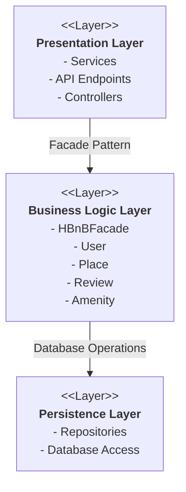
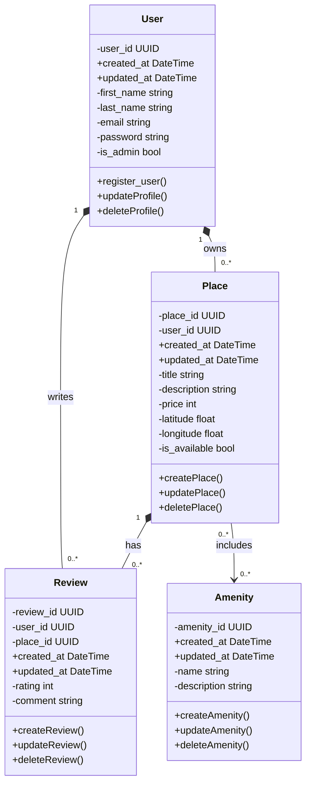
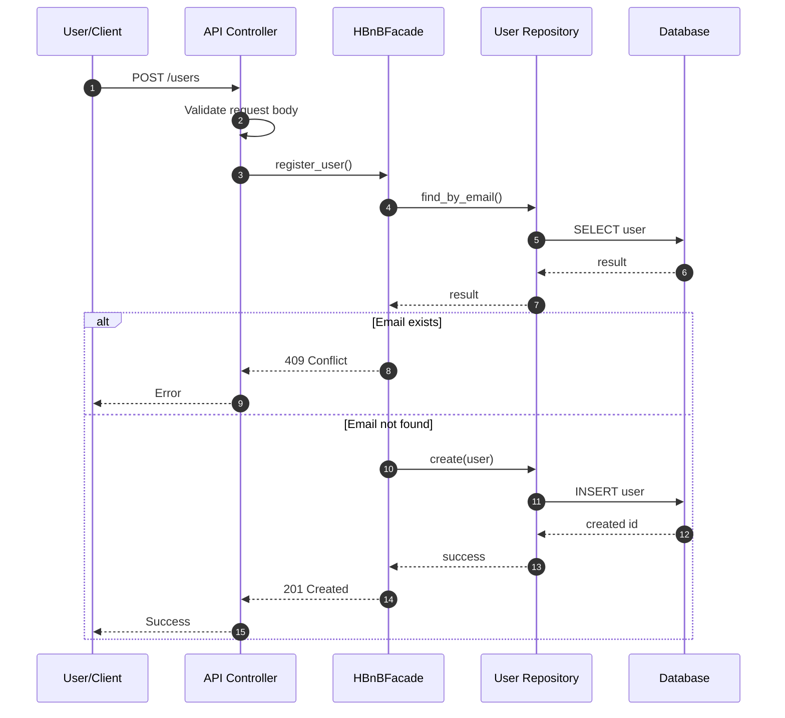
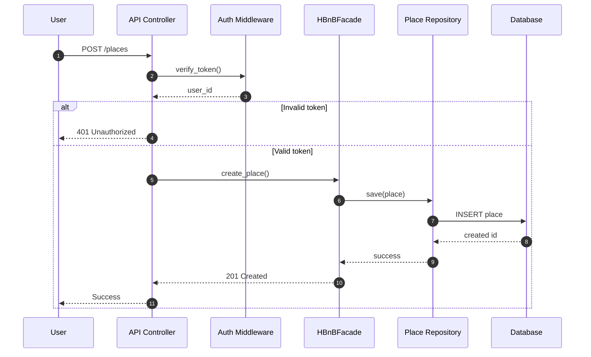
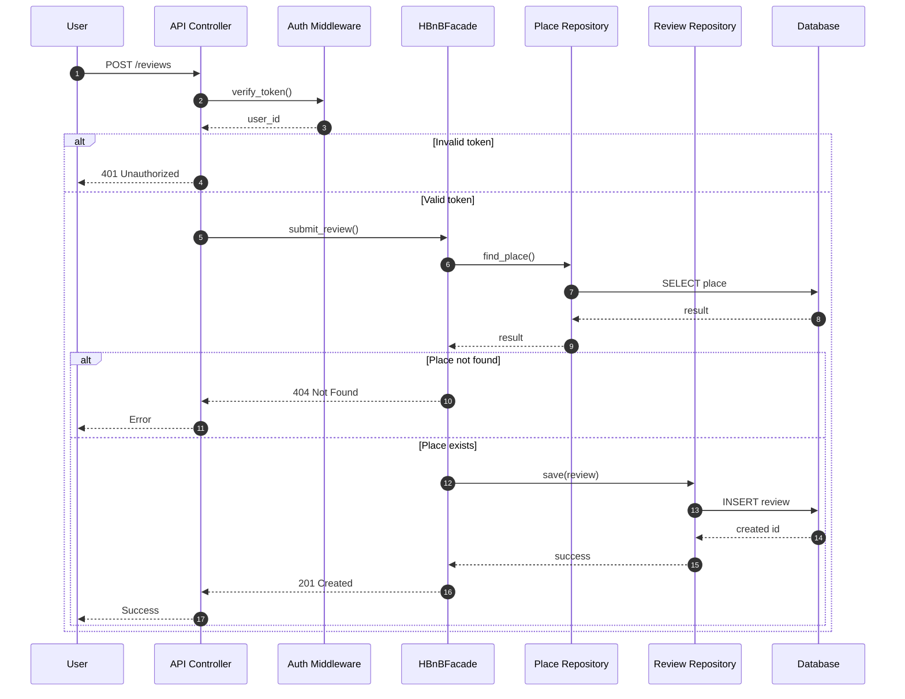
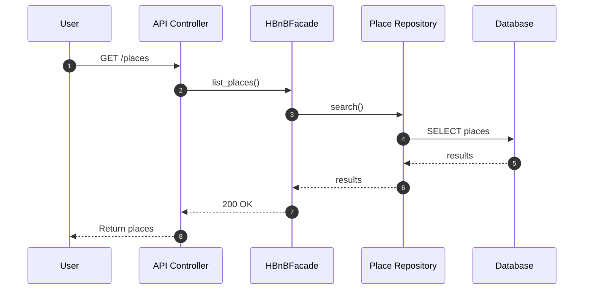

# HBnB Evolution - Technical Documentation

> A blueprint for building a property rental platform (like Airbnb!)

---

## Table of Contents

1. [Introduction](#introduction)
2. [High-Level Architecture](#high-level-architecture)
3. [Business Logic Layer](#business-logic-layer)
4. [API Interaction Flow](#api-interaction-flow)
5. [Design Decisions](#design-decisions)
6. [Implementation Guide](#implementation-guide)

---

## Introduction

### What is this document?

This is your **complete guide** to understanding how the HBnB project works. Think of it as a map that shows you:

- How different parts of the app connect
- What each component does
- How data flows through the system

### What does HBnB do?

HBnB is a rental platform where users can:

| Feature | Description |
|---------|-------------|
| Sign Up | Create an account |
| List Properties | Post places for rent |
| Browse | Search available rentals |
| Review | Rate and comment on places |
| Amenities | See what features each place offers |

### The Three-Layer Architecture

We split the app into **three main layers** to keep things organized:

```
+------------------------+
|   Presentation Layer   |  <-- Handles user requests (APIs)
+------------------------+
           |
           v
+------------------------+
|  Business Logic Layer  |  <-- The brain (rules & entities)
+------------------------+
           |
           v
+------------------------+
|   Persistence Layer    |  <-- Stores data (database)
+------------------------+
```

**Why three layers?** It's like organizing your closet - everything has its place, making it easier to find and change things later!

---

## High-Level Architecture

### System Overview



### What Each Layer Does

#### Presentation Layer

**Job:** Talk to the outside world

- Receives requests from users
- Checks if requests look valid
- Sends responses back
- Handles login tokens

#### Business Logic Layer

**Job:** Make decisions

- Manages Users, Places, Reviews, and Amenities
- Enforces rules (like "emails must be unique")
- Coordinates everything through the **HBnBFacade**

#### Persistence Layer

**Job:** Store and retrieve data

- Saves data to the database
- Fetches data when needed
- Hides database details from other layers

### The Facade Pattern - Explained Simply

The **HBnBFacade** is like a receptionist:

```
Instead of this (messy):          We do this (clean):
┌─────────┐                       ┌─────────┐
│   API   │──┬─→ UserRepo         │   API   │
│         │  ├─→ PlaceRepo        │         │
│         │  ├─→ ReviewRepo       │         │
│         │  └─→ AmenityRepo      │         │
└─────────┘                       └────┬────┘
                                       │
                                       v
                                  ┌─────────┐
                                  │ Facade  │──→ All Repos
                                  └─────────┘
```

**Benefits:**

- One entry point for all operations
- Easier to understand
- Easier to change later

---

## Business Logic Layer

### Class Diagram



### Our Four Main Entities

#### User
>
> Someone who uses the platform (owner or guest)

| Attribute | Type | What it stores |
|-----------|------|----------------|
| user_id | UUID | Unique identifier |
| first_name | string | First name |
| last_name | string | Last name |
| email | string | Must be unique! |
| password | string | Hashed for security |
| is_admin | bool | Admin privileges? |
| created_at | DateTime | When they signed up |
| updated_at | DateTime | Last profile update |

**Rules:**

- Email must be unique
- Password gets hashed (never stored as plain text!)
- Name fields are required

---

#### Place
>
> A property listed for rent

| Attribute | Type | What it stores |
|-----------|------|----------------|
| place_id | UUID | Unique identifier |
| user_id | UUID | Who owns it |
| title | string | Property name |
| description | string | Details about it |
| price | int | Cost per night |
| latitude/longitude | float | Location on map |
| is_available | bool | Can be booked? |

**Rules:**

- Must have exactly one owner (User)
- A place cannot exist without its owner
- Price must be positive
- Coordinates must be valid

---

#### Review
>
> Feedback about a place

| Attribute | Type | What it stores |
|-----------|------|----------------|
| review_id | UUID | Unique identifier |
| user_id | UUID | Who wrote it |
| place_id | UUID | Which place |
| rating | int | 1-5 stars |
| comment | string | Written feedback |

**Rules:**

- Reviews cannot exist without both a user and a place
- Rating between 1-5
- One review per user per place

---

#### Amenity
>
> Features a place offers (WiFi, Pool, etc.)

| Attribute | Type | What it stores |
|-----------|------|----------------|
| amenity_id | UUID | Unique identifier |
| name | string | e.g., "WiFi" |
| description | string | More details |

**Rules:**

- Names should be unique
- Can be used by multiple places

---

### How Entities Connect

| Relationship | Meaning |
|--------------|---------|
| User → Place | A user owns places; places depend on their owner |
| User → Review | A user authors reviews; reviews depend on the user |
| Place → Review | Reviews belong to a place and cannot exist alone |
| Place ↔ Amenity | Places can share amenities; amenities exist independently |

---
Lifecycle & Ownership Rules

- Users own Places; deleting a user removes their places
- Places own Reviews; deleting a place removes its reviews
- Users own Reviews; deleting a user removes their reviews
- Amenities are independent and can be shared across places

---

## API Interaction Flow

This section describes how API requests are processed in the HBnB system.
It illustrates the interaction between the Presentation layer, the Business Logic layer,
and the Persistence layer using sequence diagrams.

Each sequence diagram shows how a client request is validated, routed through
the HBnBFacade, processed according to business rules, and persisted using
repository abstractions. The goal is to clearly demonstrate responsibility
separation and request flow consistency across different API endpoints.

## 1) User Registration — POST /users



---

### User Registration Flow — Explanation

**Purpose**
This flow handles the creation of a new user account while ensuring data validity
and email uniqueness.

**Layer Responsibilities**

- The API Controller validates request format and required fields.
- The HBnBFacade coordinates the registration logic.
- The User Repository handles data lookup and persistence.
- The Database stores the user record.

**Business Rules Applied**

- Email addresses must be unique.
- Required fields must be provided.
- Data must follow expected formats before reaching the business layer.

**Flow Summary**

1. The client sends a registration request.
2. The controller validates the request structure.
3. The facade checks if the email already exists.
4. If the email exists, the process stops with a conflict response.
5. Otherwise, the new user is saved.
6. A success response is returned.

**Error Scenarios**

- Invalid request format → 400 Bad Request
- Email already exists → 409 Conflict
- Database failure → 500 Internal Server Error

## 2) Place Creation — POST /places



---

### Place Creation Flow — Explanation

**Purpose**
This flow allows an authenticated user to create a new place listing.

**Layer Responsibilities**

- The API Controller receives the request and delegates authentication.
- Auth Middleware validates the token and extracts the user_id.
- The HBnBFacade applies business rules and orchestrates creation.
- The Place Repository persists the place.
- The Database stores the place record.

**Business Rules Applied**

- Only authenticated users can create a place.
- The owner of the place is derived from the token (`user_id`), not trusted from the request body.
- Place fields must pass validation (e.g., required fields, non-empty values, valid price/range if defined).

**Flow Summary**

1. Client sends POST /places.
2. Controller calls auth middleware to verify the token.
3. If invalid → request stops with 401.
4. If valid → facade creates the place using the authenticated user_id.
5. Repository saves the place to the database.
6. Success response is returned.

**Error Scenarios**

- Missing/invalid token → 401 Unauthorized
- Invalid request data → 400 Bad Request
- Database failure → 500 Internal Server Error

## 3) Review Submission — POST /reviews



---

### Review Submission Flow — Explanation

**Purpose**
This flow allows an authenticated user to submit a review for an existing place.

**Layer Responsibilities**

- The API Controller receives the request and delegates authentication.
- Auth Middleware validates the token and extracts the user_id.
- The HBnBFacade ensures the place exists and applies review rules.
- The Place Repository is used to verify the target place.
- The Review Repository persists the review.
- The Database stores the review record.

**Business Rules Applied**

- User must be authenticated.
- The place must exist before creating a review.
- Review fields must be valid (e.g., rating range, required text if defined).
- The reviewer identity comes from the token (`user_id`), not trusted from the request body.

**Flow Summary**

1. Client sends POST /reviews.
2. Token is verified; invalid token stops the request with 401.
3. Facade checks that the referenced place exists.
4. If the place does not exist → return 404.
5. If it exists → repository saves the new review.
6. Success response is returned.

**Error Scenarios**

- Missing/invalid token → 401 Unauthorized
- Place not found → 404 Not Found
- Invalid review data → 400 Bad Request
- Database failure → 500 Internal Server Error

## 4) Fetch Places — GET /places



### Fetch Places Flow — Explanation

**Purpose**
This flow retrieves a list of places from the system.

**Layer Responsibilities**

- The API Controller receives the request and calls the facade.
- The HBnBFacade coordinates retrieval logic.
- The Place Repository performs the query.
- The Database returns matching place records.

**Business Rules Applied**

- This endpoint is typically read-only and may be public (no auth) unless specified otherwise.
- Optional filtering/pagination can be applied at the repository level if implemented.

**Flow Summary**

1. Client sends GET /places.
2. Controller calls list_places() on the facade.
3. Facade requests results from the repository.
4. Repository queries the database and returns results.
5. Controller returns the list with 200 OK.

**Error Scenarios**

- Database failure → 500 Internal Server Error

### Notes on Layer Separation

In all flows, the Presentation layer does not directly access the database.
All business decisions are centralized in the HBnBFacade, while repositories
encapsulate persistence operations. This separation improves maintainability
and keeps responsibilities clear across the system.

### Error Response Summary

| Code | Meaning | When it happens |
|------|---------|-----------------|
| 200 | OK | Request succeeded |
| 201 | Created | New resource made |
| 400 | Bad Request | Invalid input data |
| 401 | Unauthorized | Missing/bad token |
| 404 | Not Found | Resource doesn't exist |
| 409 | Conflict | Duplicate (like email) |
| 500 | Server Error | Something broke |

---

## Design Decisions

### Why did we build it this way?

| Decision | Why? |
|----------|------|
| **Three Layers** | Keeps code organized and testable |
| **Facade Pattern** | One clean entry point to business logic |
| **Repository Pattern** | Easy to swap databases later |
| **UUIDs** | Secure, unique IDs that don't reveal info |
| **Timestamps** | Track when things happen |
| **Email Uniqueness** | Prevent duplicate accounts |

### Why UUIDs instead of numbers?

Regular IDs (1, 2, 3...) have problems:

- Reveal how many users you have
- Easy to guess other user IDs
- Hard to merge databases

UUIDs solve all of this!

---

## Implementation Guide

### Phase 1: Database Setup

Create tables for all entities:

```sql
-- Users table
CREATE TABLE users (
    user_id UUID PRIMARY KEY,
    first_name VARCHAR(255) NOT NULL,
    last_name VARCHAR(255) NOT NULL,
    email VARCHAR(255) UNIQUE NOT NULL,
    password VARCHAR(255) NOT NULL,
    is_admin BOOLEAN DEFAULT FALSE,
    created_at TIMESTAMP DEFAULT CURRENT_TIMESTAMP,
    updated_at TIMESTAMP DEFAULT CURRENT_TIMESTAMP
);

-- Places table
CREATE TABLE places (
    place_id UUID PRIMARY KEY,
    user_id UUID NOT NULL REFERENCES users(user_id),
    title VARCHAR(255) NOT NULL,
    description TEXT,
    price INT NOT NULL,
    latitude FLOAT,
    longitude FLOAT,
    is_available BOOLEAN DEFAULT TRUE,
    created_at TIMESTAMP DEFAULT CURRENT_TIMESTAMP,
    updated_at TIMESTAMP DEFAULT CURRENT_TIMESTAMP
);

-- Amenities table
CREATE TABLE amenities (
    amenity_id UUID PRIMARY KEY,
    name VARCHAR(255) UNIQUE NOT NULL,
    description TEXT,
    created_at TIMESTAMP DEFAULT CURRENT_TIMESTAMP,
    updated_at TIMESTAMP DEFAULT CURRENT_TIMESTAMP
);

-- Link places to amenities (many-to-many)
CREATE TABLE place_amenities (
    place_id UUID REFERENCES places(place_id),
    amenity_id UUID REFERENCES amenities(amenity_id),
    PRIMARY KEY (place_id, amenity_id)
);

-- Reviews table
CREATE TABLE reviews (
    review_id UUID PRIMARY KEY,
    user_id UUID NOT NULL REFERENCES users(user_id),
    place_id UUID NOT NULL REFERENCES places(place_id),
    rating INT NOT NULL CHECK (rating BETWEEN 1 AND 5),
    comment TEXT,
    created_at TIMESTAMP DEFAULT CURRENT_TIMESTAMP,
    updated_at TIMESTAMP DEFAULT CURRENT_TIMESTAMP
);
```

### Phase 2: Build the Code

1. **Create Entity Classes** (User, Place, Review, Amenity)
2. **Create Repositories** (handle database operations)
3. **Create HBnBFacade** (coordinate everything)
4. **Create API Controllers** (handle HTTP requests)

### Phase 3: Test Everything

- **Unit tests** → Test each piece alone
- **Integration tests** → Test pieces working together
- **End-to-end tests** → Test full user journeys

---

## Quick Reference

### API Endpoints

| Method | Endpoint | What it does |
|--------|----------|--------------|
| POST | /users | Register new user |
| GET | /users | List all users |
| PUT | /users/{id} | Update user |
| POST | /places | Create place |
| GET | /places | List places |
| GET | /places/{id} | Get one place |
| PUT | /places/{id} | Update place |
| POST | /reviews | Submit review |
| GET | /reviews | List reviews |
| POST | /amenities | Create amenity |
| GET | /amenities | List amenities |

### Layer Communication

```
Client Request
      ↓
[Presentation] → Validates input
      ↓
[Business Logic] → Applies rules
      ↓
[Persistence] → Saves/retrieves data
      ↓
Database
```

---

**Happy Coding!**

*This document serves as a roadmap. Follow the architecture, respect the layers, and your HBnB project will be clean and maintainable.*
