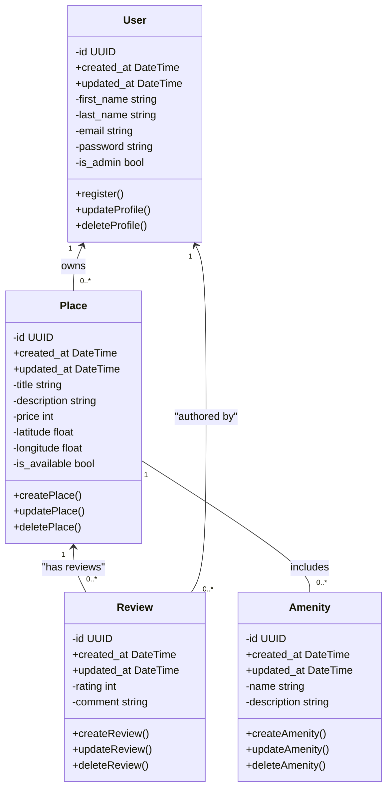

# HBnB Evolution - Class Diagram

## Overview

This diagram shows the main building blocks of the HBnB application - a property rental platform similar to Airbnb.

## Class Diagram

## Explanation

This class diagram clarifies classes, attribute names, and relationships used in the HBnB model. Key points:

## Classes at a Glance

| Class | Purpose |
|-------|---------|
| **User** | People who use the app (Owners & guests) |
| **Place** | Properties available for rent |
| **Review** | Feedback left by guests |
| **Amenity** | Features a place offers (WiFi, Pool, etc.) |

---

- User
  - Represents an account in the system.
  - Primary key: `id` (UUID). Timestamps `created_at` and `updated_at` are included for auditing.
  - A single User can own zero or many Places (one-to-many).

- Place
  - Represents a rentable listing (property).
  - Primary key: `id` (UUID). Includes location (latitude/longitude), price and availability flag.
  - Each Place is owned by exactly one User; a User may own multiple Places.
  - A Place can have many Reviews.

- Review
  - Represents feedback left by a User about a Place.
  - Each Review is authored by one User and belongs to one Place. Both User and Place can have zero or many Reviews.

- Amenity
  - Reusable facility/feature (e.g., WiFi, Air conditioning).
  - Amenities are linked to Places in a one-to-many relationship (diagram shows a conceptual direct association).

---

| Relationship | Type | Description |
| -------------- | ------ | ------------- |
| User → Place | 1 to Many | One user can own multiple places |
| User → Review | 1 to Many | One user can write multiple reviews |
| Place → Review | 1 to Many | One place can have multiple reviews |
| Place → Amenity | 1 to Many | One place can have multiple amenities |

---

## Quick Summary

- **Users** create **Places** (listings)
- **Users** write **Reviews** about **Places**
- **Places** include **Amenities** (features)
