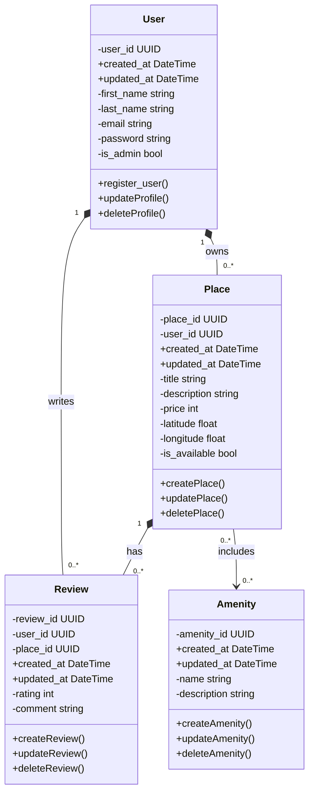

# HBnB Evolution - Class Diagram

## Overview

This diagram shows the main building blocks of the HBnB application - a property rental platform similar to Airbnb.

## Class Diagram

## Explanation

This class diagram summarizes the core entities and relationships used in the HBnB business logic layer. It focuses on how users, places, reviews, and amenities are structured and how they interact.

### Overview of Classes

| Class | Description |
|------|-------------|
| **User** | Represents a platform user (owner or guest) |
| **Place** | A property listed for rent |
| **Review** | Feedback written by users about places |
| **Amenity** | Features that can be shared across places |

### Relationship Summary

- A **User** can own multiple **Places**, and each Place belongs to exactly one User.
- A **User** can write multiple **Reviews**, and each Review is authored by one User.
- A **Place** can have multiple **Reviews**, and each Review refers to one Place.
- **Places** and **Amenities** have a many-to-many association, allowing amenities to be shared across multiple places.

### Key Takeaways

- **Places** and **Reviews** depend on their owning entities for their lifecycle.
- **Amenities** exist independently and can be reused by multiple places.
- The diagram captures ownership, authorship, and shared features at the business logic level.
