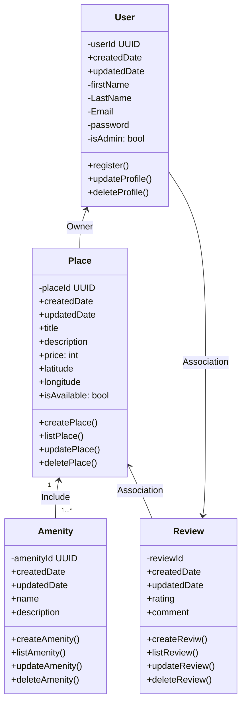

# Class Diagram – HBnB Evolution

```mermaid
classDiagram
class User {
    -userId UUID
    +createdDate
    +updatedDate
    -firstName
    -LastName
    -Email
    -password
    -isAdmin: bool
    +register()
    +updateProfile()
    +deleteProfile()
}
class Review {
    -reviewId
    +createdDate
    +updatedDate
    +rating
    +comment
    +createReviw()
    +listReview()
    +updateReview()
    +deleteReview()
}
class Amenity {
    -amenityId UUID
    +createdDate
    +updatedDate
    +name 
    +description
    +createAmenity()
    +listAmenity()
    +updateAmenity()
    +deleteAmenity()
}
class Place {
    -placeId UUID
    +createdDate
    +updatedDate
    +title
    +description
    +price: int
    +latitude
    +longitude
    +isAvailable: bool
    +createPlace()
    +listPlace()
    +updatePlace()
    +deletePlace()
}
User <-- Place : Owner
Place "1" <-- "1...*" Amenity : Include
Place <-- Review: Association
Review <-- User: Association
```
